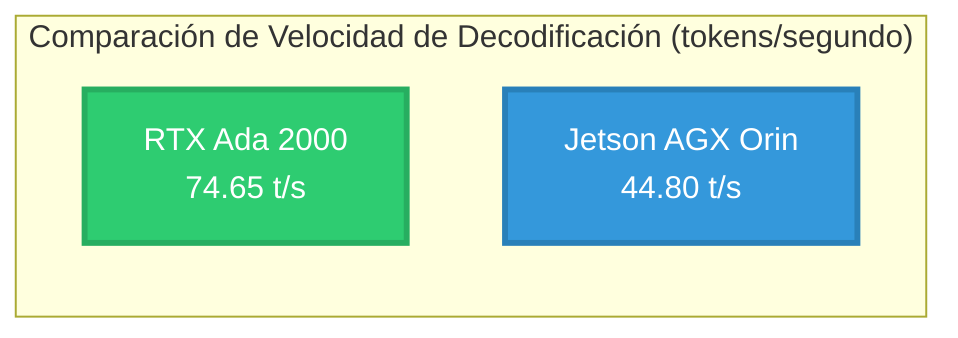
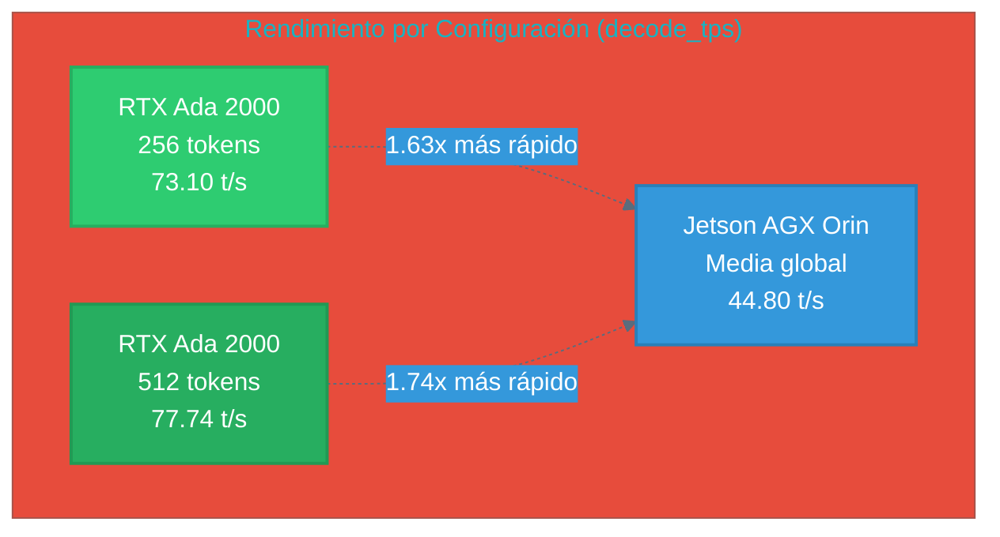
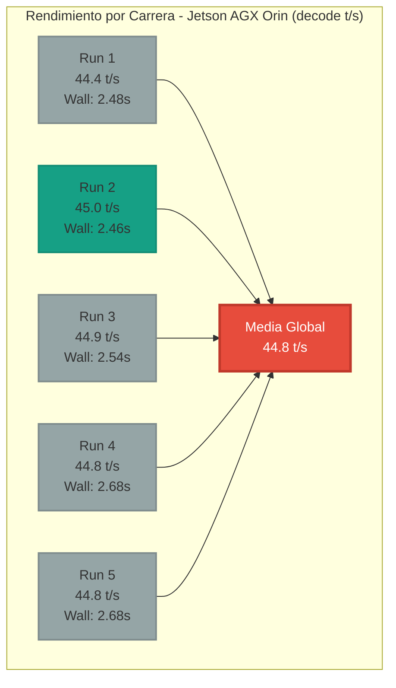
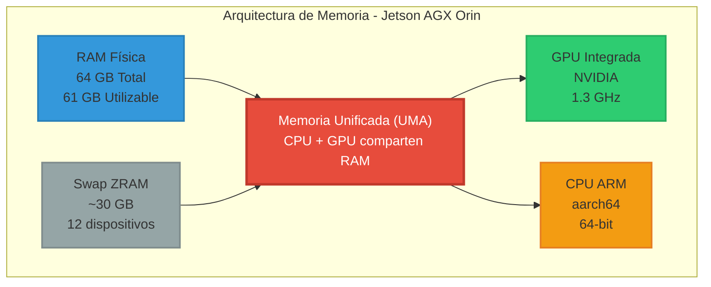
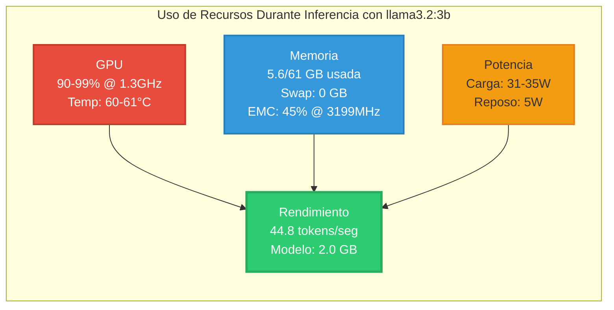
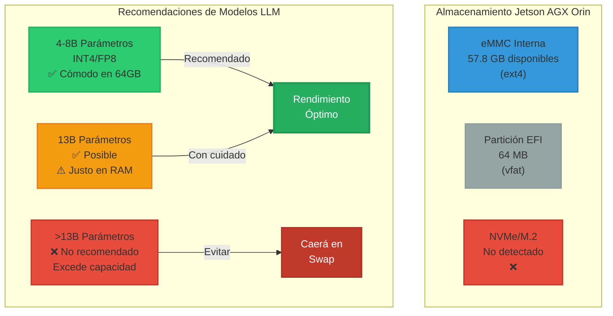
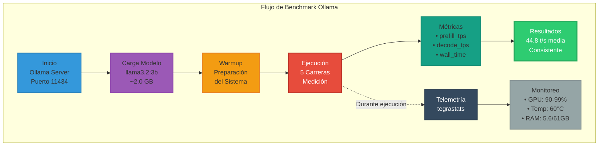
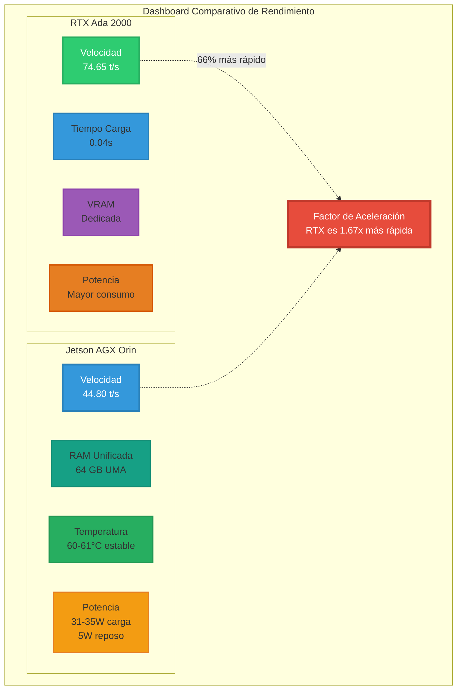

# Informe Técnico — NVIDIA Jetson AGX Orin

## 1. Identificación del Sistema

| Característica | Especificación |
|---------------|----------------|
| **Modelo** | NVIDIA Jetson AGX Orin Developer Kit (aarch64) |
| **SO/L4T/JetPack** | L4T r36.4.4 (JetPack 6.2.1), fecha 2025-06-16 |
| **CUDA** | 12.6 (detectado por autotag) |
| **Ubuntu** | 22.04 (Jammy) |
| **Docker** | Runtime por defecto nvidia (nvidia-container-toolkit configurado) |

## 2. Memoria (RAM, Swap y "VRAM")

### Especificaciones de Memoria
- **RAM física**: 64 GB (MemTotal ≈ 64,349,016 kB)
  - Linux reporta utilizable ≈ 61 GiB (resto reservado para GPU/firmware)
- **Swap zram**: ~30 GiB (12 dispositivos zram de ~2.6 GiB)
- **VRAM dedicada**: No existe. Jetson usa memoria unificada (UMA): CPU y GPU comparten la RAM del sistema

### Gestión de Memoria GPU
- En la práctica, la "VRAM disponible" ≈ RAM libre que ves en `free -h`/`tegrastats`
- Ejemplo (tegrastats): `RAM 5001/62841MB` ⇒ ~57.8 GB libres (disponibles para GPU si es necesario)

## 3. Almacenamiento

### eMMC Interna
- **Capacidad total**: ~59.2 GB
  - **Partición raíz** `/` (ext4): ~57.8 GB
  - **EFI** `/boot/efi`: 64 MB (vfat)

### NVMe/M.2
- **Estado**: No detectado actualmente
- `lspci` solo muestra la Wi-Fi Realtek RTL8822CE
- `parted /dev/nvme0n1` falla
- `dmesg` indica "Phy link never came up" en otros puentes PCIe → no hay NVMe presente o no enlaza

## 4. ¿Por qué Jetson "usa RAM" y no VRAM?

### Arquitectura de Memoria Unificada
- Es un SoC ARM con GPU integrada; no hay tarjeta gráfica separada con GDDR propia
- La LPDDR del sistema sirve tanto a CPU como a GPU (memoria unificada)

### Para LLMs:
- **Pesos del modelo + KV-cache** residen en RAM
- **GPU acelera el cómputo** leyendo esa RAM por el bus de memoria de alto ancho de banda
- **Si la RAM se agota**, entra la swap zram (más lenta) → baja el rendimiento

## 5. Arquitectura y Aceleración (ARM + GPU integrada)

### Especificaciones Hardware
- **CPU**: ARM aarch64 (64-bit)
- **GPU**: Integrada en el SoC (NVIDIA), comparte RAM del sistema (UMA)

### Lecturas típicas de tegrastats:
- **GR3D_FREQ**: Frecuencia de GPU (ej. 0%@[1300,1300] cuando está ociosa)
- **EMC_FREQ**: Controlador de memoria (ej. 0%@3199 → ~3.2 GHz)
- **Temperaturas/potencia** (CPU/GPU) también disponibles

## 6. Implicaciones Prácticas para LLM en Jetson (64 GB)

### Tamaños de modelo recomendados:
- **4–8B parámetros** en INT4/FP8 → cómodos en 64 GB UMA
- **13B** puede funcionar, pero más justo (RAM y ancho de banda)

### Consideraciones de Memoria:
- **Contexto (tokens)** aumenta mucho la KV-cache ⇒ más RAM
- **Espacio en disco** necesario para:
  - Pesos (HF_HOME)
  - Compilar/optimizar (MLC_CACHE_DIR)
  - Audios (Piper/Riva)

### Rendimiento:
- Evitar caer en swap
- Si `free -h` baja demasiado, reducir tamaño del modelo o contexto

## 7. Comandos Útiles

```bash
# RAM / swap / disponibilidad
free -h
sudo tegrastats --interval 1000

# Almacenamiento
df -h
du -xh --max-depth=1 ~ | sort -h

# PCIe / NVMe
sudo lspci -nn
sudo dmesg | egrep -i 'pcie|nvme|m\.2' | tail -n 200
```

---

# Pruebas de Rendimiento con Ollama

## Informe de Prueba — Jetson + Ollama (llama3.2:3b)

### Resultados Clave
- **Velocidad**: ~44.8 tokens/seg en decodificación (media de 5 ejecuciones)
- **GPU**: Uso intensivo (90-99%) con temperaturas normales (~60°C)
- **Modelo**: llama3.2:3b (~2.0 GB en disco)
- **Telemetría**: GPU al 90–99% @ ~1.3 GHz durante inferencia

### Equipo y SO
| Componente | Especificación |
|------------|----------------|
| **Dispositivo** | NVIDIA Jetson AGX Orin Developer Kit |
| **L4T / JetPack** | R36.4.4 / 6.2.1 |
| **CUDA** | 12.6 |
| **RAM del sistema** | ~64 GB (MemTotal ≈ 61–62 GiB utilizable) |
| **Almacenamiento** | eMMC ~57 GB (liberado y organizado) |

> **Nota**: En Jetson no hay VRAM dedicada. La GPU usa memoria unificada (UMA): comparte la RAM del sistema.

### Preparación

```bash
# Instalación del modelo
ollama run llama3.2:3b   # (descarga ~2.0 GB la primera vez)

# Entorno de prueba (aislado)
python3 -m venv .venv && source .venv/bin/activate
echo 'requests>=2.31' > requirements.txt
pip install -r requirements.txt
```

### Script de Benchmark

**Archivo**: `test_ollama_llama3.2:3b_jetson.py`

Características del script:
- Se conecta a `http://localhost:11434`
- Hace warmup
- Ejecuta N carreras con medición de:
  - prefill_tokens / decode_tokens
  - prefill_tps / decode_tps
  - wall time

### Metodología de Prueba

```bash
python test_ollama_llama3.2:3b_jetson.py --model llama3.2:3b -n 5 --out metrics.jsonl
```

### Resultados (5 carreras)

| Run | wall (s) | prefill tok | prefill t/s | decode tok | decode t/s |
|-----|----------|-------------|-------------|------------|------------|
| 1   | 2.48     | 45          | 5,199       | 107        | 44.4       |
| 2   | 2.46     | 45          | 11,687      | 108        | 45.0       |
| 3   | 2.54     | 45          | 11,580      | 111        | 44.9       |
| 4   | 2.68     | 45          | 11,712      | 117        | 44.8       |
| 5   | 2.68     | 45          | 11,435      | 117        | 44.8       |

**Media decode_tps**: 44.8 tok/s (5 runs)

> **Observación**: El prefill_tps es muy alto (prefill es más paralelo); lo importante para velocidad de conversación es decode_tps (~45 t/s).

### Telemetría (tegrastats) durante inferencia

- **GPU (GR3D_FREQ)**: 90–99% @ ~1.30 GHz
- **EMC (memoria)**: ~45% @ 3199 (no cuello de botella)
- **RAM**: ~5.6 / 61 GiB usada (mucho margen), swap 0
- **Temperaturas**: ~60–61°C (estables)
- **Potencia (VDD_GPU_SOC)**: ~31–35 W en carga; ~5 W en reposo

### Conclusiones

- El Jetson AGX Orin maneja llama3.2:3b con ~45 tok/s de decodificación y uso efectivo de GPU
- Temperatura y consumo dentro de rangos normales; RAM suficiente sin tocar swap
- La arquitectura UMA simplifica memoria (no VRAM aparte) y funciona bien para LLMs con tamaños moderados

---

# Comparativo — RTX Ada 2000 vs Jetson AGX Orin

**Modelo**: llama3.2:3b (Ollama)

## 1. Resumen

Se comparó el rendimiento de generación (decodificación de tokens) del modelo llama3.2:3b ejecutado con Ollama en dos entornos:
- Portátil con GPU NVIDIA RTX Ada 2000
- Jetson AGX Orin

Las métricas provienen de la API de Ollama (prompt_eval_count, eval_count, *_duration en ns), convertidas a tokens por segundo (t/s).

**Resultado clave**: La RTX Ada 2000 alcanzó una media global de **74.65 t/s** frente a **44.8 t/s** en Jetson, lo que supone un factor de aceleración **≈ 1.67×**.

## 2. Metodología

| Parámetro | Configuración |
|-----------|---------------|
| **Modelo idéntico** | llama3.2:3b |
| **Servidor** | Ollama local (HTTP 11434) |
| **Parámetros clave** | temperature=0, seed=42, num_ctx 2048/4096, num_predict 256 y 512 |
| **Métrica primaria** | decode_tps (eval_count / eval_duration) |
| **Runs RTX** | 9 (6 con num_predict=256 y 3 con 512) |
| **Runs Jetson** | 5 |

> **Limitación**: En Jetson sólo se dispone de la media de decode_tps (44.8 t/s) en el informe aportado.

## 3. Comparativa de decode_tps medio (t/s)

```
RTX Ada 2000:  ████████████████████████████████████████████████████████████████████████ 74.65
Jetson Orin:   ████████████████████████████████████████████ 44.80
```

### Resumen por lote (RTX) y referencia Jetson:

| Equipo/Lote | num_predict | runs | decode_tps media | mediana | p90 | min | max | total_s media | load_s media | decode_tokens media |
|-------------|-------------|------|------------------|---------|-----|-----|-----|---------------|--------------|-------------------|
| **RTX Ada 2000** | 256 | 6 | **73.10** | 72.56 | 78.46 | 67.50 | 79.53 | 1.394 | 0.044 | 97.8 |
| **RTX Ada 2000** | 512 | 3 | **77.74** | 75.55 | 82.98 | 72.85 | 84.83 | 1.444 | 0.040 | 108.7 |
| **Jetson AGX Orin** | — | 5 | **44.80** | n/d | n/d | n/d | n/d | n/d | n/d | n/d |

**Aceleración relativa de decode_tps (RTX/Jetson)**: 
- 1.63× (256 tokens)
- 1.74× (512 tokens)
- 1.67× (global)

## 4. Interpretación

- La RTX Ada 2000 ofrece entre **~1.6× y ~1.7×** más velocidad de decodificación que Jetson con el mismo modelo
- Rendimiento consistente entre lotes de 256 y 512 tokens previstos
- El tiempo de carga (`load_s`) en RTX es bajo (~0.04 s), indicio de buen cacheo y servidor en caliente
- Diferencias de `num_ctx` entre pruebas (2048 vs 4096) no alteran la conclusión principal

> **Recomendación**: Para una comparación 1:1 más precisa, se recomienda repetir ambos lados con los mismos flags finales.

---

# Gráficos Comparativos y Visualizaciones

## Comparación de Rendimiento: RTX Ada 2000 vs Jetson AGX Orin



## Comparación Detallada por Configuración



## Resultados de las 5 Carreras en Jetson AGX Orin



## Arquitectura de Memoria - Jetson AGX Orin



## Telemetría Durante Inferencia



## Almacenamiento y Recomendaciones de Modelos LLM



## Flujo de Trabajo del Benchmark



## Dashboard Comparativo Final



---
